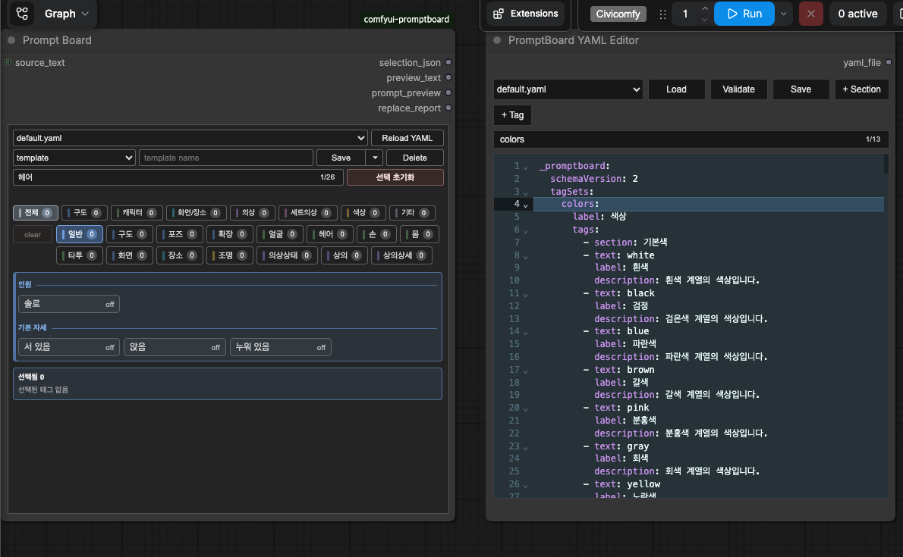
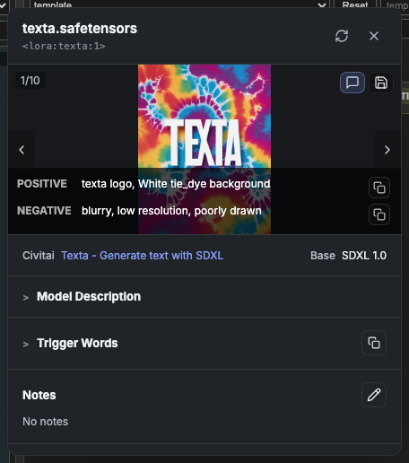

# ComfyUI PromptBoard

ComfyUI PromptBoard is a small custom node package for building prompt text from YAML-managed tag boards.

It keeps prompt fragments in YAML files, lets you select tags from a board-style UI, and replaces placeholders in source prompt text.

It also includes a multi-LoRA loader and a shared checkpoint/LoRA model info dialog for local metadata, notes, Civitai data, and preview images.

## Nodes

### Prompt Board

`Prompt Board` loads a YAML tag file and exposes a board UI inside ComfyUI.

Outputs:

- `selection_json`: structured selection data for downstream replacement
- `preview_text`: a readable preview of selected placeholders and values
- `prompt_preview`: source prompt text after applying the current selection
- `replace_report`: replacement warnings such as unknown placeholders or cycles

Main features:

- YAML file selector
- `Reload YAML` for reading the selected YAML file after external or editor-node changes
- collapsible tag groups
- group-level select/clear
- board tag search with match count, current match highlight, automatic group expansion, and `Enter` / `Shift+Enter` navigation
- board templates for saving, loading, and automatically restoring selected states
- template save with `Cmd+S` / `Ctrl+S` from board-side controls, using the current Save mode
- reusable `tagSets` for sharing the same tag metadata across categories
- attribute boards for target-specific selections such as top color and bottom color
- `migrateFrom` support for reading old template selections into new attribute state
- automatic replacement preview output

### PromptBoard YAML Editor

`PromptBoard YAML Editor` is a separate management node for editing YAML files.

Outputs:

- `yaml_file`: selected YAML file name
- `validation_report`: schema validation summary or structured error
- `save_report`: latest load, edit, validation, or save status

Main features:

- YAML file selector independent from `Prompt Board`
- YAML source load and edit
- schema validation
- automatic backup before saving
- YAML save
- `+ Section` and `+ Tag` dialogs for appending entries to a category or section
- duplicate tag text blocking and duplicate label warning

Saving in `PromptBoard YAML Editor` does not automatically change an existing `Prompt Board` node. Use `Reload YAML` on `Prompt Board` when you want the board to read the saved file again.

### Prompt Board Replace

`Prompt Board Replace` takes source text plus `selection_json` from `Prompt Board`, then replaces matching placeholders.

Example source text:

```text
<SUBJECT>, <STYLE>, <LIGHTING>, <CAMERA>, <COLOR>, <DETAIL>
```

If the board selects `portrait`, `cinematic`, and `soft light`, the replace node writes those values into the matching placeholders.

### PromptBoard LoRA Loader

`PromptBoard LoRA Loader` applies multiple LoRAs to a `model` and `clip`.

The node stores its rows as JSON internally while exposing a row-based UI for:

- adding LoRA rows
- enabling or disabling each row
- searching and selecting a LoRA file
- editing model and clip strengths
- opening LoRA metadata and Civitai info
- deleting rows

Example `lora_config`:

```json
[
  {
    "enabled": true,
    "lora_name": "example.safetensors",
    "strength_model": 1.0,
    "strength_clip": 1.0
  }
]
```

Disabled rows, empty names, `None`, and rows where both strengths are `0` are skipped.

## Screenshots

### Prompt Board

The workflow screenshot below uses the included `default.yaml` starter tag file. It shows the current board structure and a complete text flow:

- `Text Box (source_text)` provides source text with placeholders.
- `Prompt Board` selects YAML-managed tags and sends `preview_text` to `Preview as Text - Board Preview`.
- `Prompt Board Replace` receives `source_text` and `selection_json`, then sends its replaced `text` output to `Preview as Text - Replace Result`.

The example also demonstrates `uiGroup` filters, tag labels, descriptions, selected-count badges, and nested replacement through `replaceInsideTags`.



### LoRA Info Dialog

The compact LoRA info dialog screenshot below uses `TMP/texta.safetensors`.



## YAML Format

YAML files live in:

```text
ComfyUI/custom_nodes/comfyui-promptboard/tags/
```

`default.yaml` is included as a starter file and demonstrates the current YAML structure.

Example:

```yaml
STYLE:
  placeholder: <STYLE>
  uiGroup: Look
  tags:
  - text: cinematic
    label: Cinematic
    description: Film-like lighting, composition, and mood.
  - text: editorial
    label: Editorial
    description: Polished magazine-style visual direction.
  - text: watercolor
    label: Watercolor
    description: Soft painted texture with translucent color.

COLOR:
  placeholder: <COLOR>
  uiGroup: Look
  tags:
  - text: warm
    label: Warm
    description: Reds, oranges, yellows, or warm color balance.
  - text: cool
    label: Cool
    description: Blues, cyans, violets, or cool color balance.
  - text: pastel
    label: Pastel
    description: Soft, low-saturation color palette.
```

Each top-level key is a board category.

- `placeholder`: the placeholder replaced by `Prompt Board Replace`
- `uiGroup`: the board filter group shown above the cards
- `tags`: selectable prompt fragments for the category

Tags can be written as plain strings for quick editing:

```yaml
DETAIL:
  placeholder: <DETAIL>
  uiGroup: Detail
  tags:
  - highly detailed
  - crisp focus
```

Use object tags when the UI should show a friendly label or description:

```yaml
DETAIL:
  placeholder: <DETAIL>
  uiGroup: Detail
  tags:
  - text: highly detailed
    label: Highly Detailed
    description: Extra visible detail in surfaces and objects.
  - text: crisp focus
    label: Crisp Focus
    description: Sharp subject edges and clear focal detail.
```

Object tag fields:

- `text`: the actual prompt text used for replacement
- `label`: optional UI label shown on the board
- `description`: optional tooltip/search description
- `default`: optional boolean; selected automatically when the category has no saved selection

`value` is also accepted as an alias for `text`, but new YAML files should use `text`.

### Reusable Tag Sets

Use schema v2 `tagSets` when multiple categories need the same selectable tags.
The tag metadata is written once, while selections remain independent for each category.

```yaml
_promptboard:
  schemaVersion: 2
  tagSets:
    colors:
      label: Colors
      tags:
      - text: black
        label: Black
        description: Black color.
      - text: white
        label: White
        description: White color.

TOP_COLOR:
  placeholder: <TOP_COLOR>
  uiGroup: Color
  tagSet: colors

BOTTOM_COLOR:
  placeholder: <BOTTOM_COLOR>
  uiGroup: Color
  tagSet: colors
```

A category must use either `tags` or `tagSet`, not both. Unknown tag-set names,
empty tag sets, and malformed tag entries are reported as YAML errors with their paths.

### Attribute Boards

Use `attributeBoards` when the same tag set should be selected separately for several targets.
This is useful for repeated attributes such as top color, bottom color, outerwear color, and underwear color.

```yaml
_promptboard:
  schemaVersion: 2
  tagSets:
    colors:
      label: Colors
      tags:
      - text: black
        label: Black
      - text: white
        label: White

  attributeBoards:
    clothingColors:
      label: Clothing Colors
      uiGroup: Color
      targets:
        top:
          label: Top
          placeholder: <TOP_COLOR>
          compose:
            separator: " "
          attributes:
            color:
              label: Color
              source: colors
              mode: single
              migrateFrom: TOP_COLOR
        bottom:
          label: Bottom
          placeholder: <BOTTOM_COLOR>
          attributes:
            color:
              label: Color
              source: colors
              mode: single
              migrateFrom: BOTTOM_COLOR

TOP:
  placeholder: <CLOTHES>
  uiGroup: Clothes
  tags:
  - text: <TOP_COLOR> shirt
    label: Shirt

BOTTOM:
  placeholder: <CLOTHES>
  uiGroup: Clothes
  tags:
  - text: <BOTTOM_COLOR> skirt
    label: Skirt
```

Attribute state is stored under the reserved `$attributes` key in board templates and workflow widgets.
It is not written as a normal category.

```json
{
  "TOP": ["<TOP_COLOR> shirt"],
  "$attributes": {
    "clothingColors": {
      "top": {
        "color": ["black"]
      }
    }
  }
}
```

When the board builds `selection_json`, each target becomes an internal `$attribute:` entry.
`Prompt Board Replace` uses the same replacement path as normal categories, so `<TOP_COLOR> shirt` becomes `black shirt`.

`migrateFrom` is only a read-compatibility bridge. If a saved template still has `TOP_COLOR: ["black"]` but no `$attributes.clothingColors.top.color`, PromptBoard reads the old value into the new attribute. Once the template is saved again, the new `$attributes` state is preserved.

Attribute modes:

- `single`: selecting one tag clears the previous tag for that target and attribute
- `multiple`: several tags can be selected and are composed in YAML tag order

`compose.separator` controls how selected attributes are joined. Empty attributes are skipped, so extra separators are not generated.

### Nested Replacement

Use `replaceInsideTags: true` when a category is meant to replace placeholders inside another selected tag.

```yaml
OBJECT:
  placeholder: <OBJECT>
  uiGroup: Content
  tags:
  - text: <MATERIAL> sculpture
    label: Material Sculpture
    description: A sculpture whose material is filled by the MATERIAL category.
  - text: <MATERIAL> chair
    label: Material Chair
    description: A chair whose material is filled by the MATERIAL category.

MATERIAL:
  placeholder: <MATERIAL>
  uiGroup: Content
  replaceInsideTags: true
  tags:
  - text: glass
    label: Glass
    description: Transparent or reflective glass material.
  - text: marble
    label: Marble
    description: Polished stone with natural veining.
```

If `OBJECT` selects `<MATERIAL> sculpture` and `MATERIAL` selects `glass`, `Prompt Board Replace` resolves the selected object as `glass sculpture`.

`replaceInsideTags` is still useful for ordinary categories that provide a nested placeholder value.
`attributeBoards` are for target-specific UI state and reusable tag sets. Prefer `attributeBoards` when one shared candidate list needs separate selections for several targets.

## Installation

Clone the repository into your ComfyUI custom nodes folder:

```bash
cd ComfyUI/custom_nodes
git clone https://github.com/kimhr3001/comfyui-promptboard.git
```

Restart ComfyUI after installation.

## Files and User Data

Only `tags/default.yaml` is intended to be tracked by git.

Additional YAML files and saved board templates are user data and are ignored by `.gitignore`.

## Editor Theme

`PromptBoard YAML Editor` uses the bundled CodeMirror 6 editor for YAML editing, with a textarea fallback when CodeMirror cannot be loaded.

Editor colors are controlled by:

```text
web/vendor/codemirror/css/thema.css
```

The default theme is Material-style dark. To change the editor appearance, edit the CSS variables in `thema.css`.

Syntax token colors are also routed through CSS variables, so the theme file remains the single place for editor color changes.

## Templates

Board templates save the selected YAML file and selected tag state.

When a workflow is reopened or the browser is refreshed, the last selected template for that node is restored automatically if the template still exists. If the template was removed, PromptBoard falls back to the workflow's saved YAML file and selection state.

The template Save button has selectable modes:

- `Save`: updates the typed template name
- `Save (New)`: saves with the typed name, adding a numeric suffix when that name already exists

Use `Cmd+S` on macOS or `Ctrl+S` on Windows/Linux while focus is in the board-side controls to run the currently selected Save mode.

## Search

PromptBoard has one board search field:

- Board search: searches category names, tag labels, and tag values, expands a collapsed group when needed, scrolls to the current match, and highlights the matched group or tag.

The search field shows match position as `current/total`. Press `Enter` for the next match and `Shift+Enter` for the previous match.

## Model Info

Right-click a supported checkpoint loader node and choose `View Checkpoint Info...` to inspect local metadata, notes, SHA256, matching Civitai model information, and preview images when available.

LoRA rows in `PromptBoard LoRA Loader` also include an `i` button that opens a LoRA-specific info dialog for the selected LoRA.

The checkpoint and LoRA dialogs share the same compact vertical UI. Preview galleries include bounded image height, previous/next navigation, a prompt overlay toggle when Civitai image metadata provides positive or negative prompts, and an icon button for storing the selected image next to the model file.

Trigger words are shown as clickable chips when available. Click a chip to copy a single trigger word, or use the copy icon in the Trigger Words header to copy all trigger words as a comma-separated prompt fragment.

The prompt overlay includes separate copy buttons for positive and negative prompt text. Notes can be edited directly from the dialog and are stored next to the model metadata.

PromptBoard stores Civitai JSON metadata next to the model as:

```text
<model>.civitai.json
```

Representative preview images are stored next to the model using the same basename and an image extension, for example:

```text
example.safetensors
example.png
```

If a representative preview already exists, the info dialog can show that local image without contacting Civitai on first open. Use `Refresh` to fetch the latest Civitai metadata.

Supported checkpoint widgets:

- `CheckpointLoader`
- `CheckpointLoaderSimple`
- `CheckpointLoader|pysssss`
- `Efficient Loader`
- `Eff. Loader SDXL`

## Development

Validate the Python files:

```bash
python -m py_compile __init__.py yaml_tag_nodes.py yaml_tag_board_split_nodes.py yaml_editor_nodes.py lora_loader_nodes.py model_info.py
```

Validate the browser extension script:

```bash
node --check web/js/yaml_tag_board_split.js
```

Validate the checkpoint info extension script:

```bash
node --check web/js/model_info.js
```

Validate the LoRA loader extension script:

```bash
node --check web/js/lora_loader.js
```

Validate the bundled CodeMirror module:

```bash
node --check web/vendor/codemirror/promptboard-codemirror.bundle.js
```

## Contribution Policy

This is a public personal project by `kimhr3001`.

Pull requests are welcome, but merge permission is intentionally limited to the repository owner. Please keep PRs focused and describe the workflow impact clearly.
